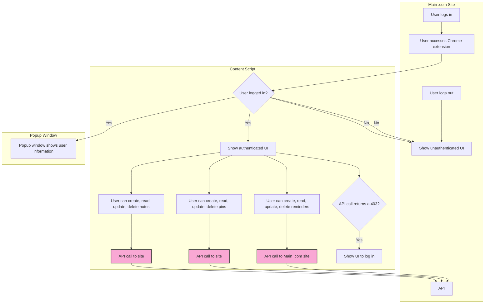
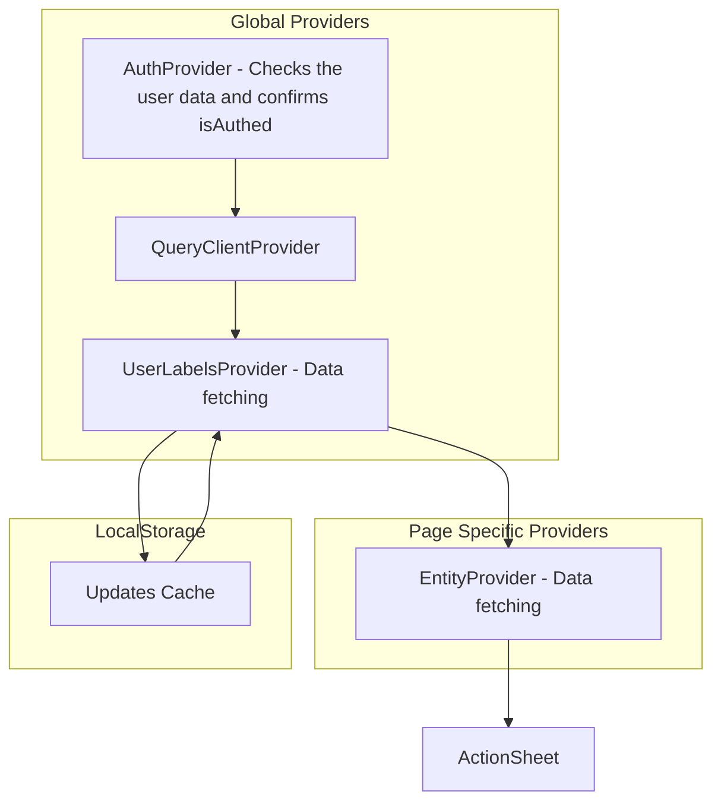

<a href="https://dossi.dev">
  
</a>

  <h3 align="center">dossi</h3>

  <p align="center">
    Your own private GitHub notes on every page
    <br />
    <a href="https://dossi.dev"><strong>Learn more »</strong></a>
    <br />
    <br />
    <a href="https://dossi.dev">Website</a>
    |
    <a href="https://github.com/siegerts/dossi-app">Web app and API</a>
    |
     <a href="https://github.com/siegerts/dossi-ext/issues">Feedback</a>
  </p>

## Introduction

This is the **browser extension** for dossi, a note-taking app that allows you to [add notes on GitHub issues, pull requests, and more](https://www.dossi.dev/docs).

## Functionality

- [Sidepanel overlay](https://github.com/siegerts/dossi-ext/blob/main/contents/connct-sidebar.tsx) on GitHub pages to add, edit, and delete notes
  - Label creation
  - Pin pages to view later
  - Note management (create, read, update, delete, sort) with "light" markdown support
- [Popup window](https://github.com/siegerts/dossi-ext/blob/main/popup.tsx) to view recent activity and pins
- Content script button to open the sidepanel overlay and display the number of notes for the current page
- [Transferred page detection](https://github.com/siegerts/dossi-ext/blob/main/background.ts#L54) to prompt the user to transfer notes to the new page entity
- Auth integration with dossi web app


## Tech Stack

- [Plasmo](https://github.com/PlasmoHQ/plasmo) – browser extension framework
- [TypeScript](https://www.typescriptlang.org/) – language
- [shadcn/ui](https://ui.shadcn.com/) – UI components
- [Tailwind](https://tailwindcss.com/) – CSS
- [TanStack/react-query](https://react-query.tanstack.com/) – data fetching
- [zod](https://github.com/colinhacks/zod) – schema validation


## Brower API Compatibility

| API             | Chrome       | Firefox      |
| --------------- | ------------ | ------------ |
| `tabs`          | ✅ Supported | ✅ Supported |
| - `query`       | ✅ Supported | ✅ Supported |
| - `sendMessage` | ✅ Supported | ✅ Supported |
| - `onUpdated`   | ✅ Supported | ✅ Supported |
| `webNavigation` | ✅ Supported | ✅ Supported |
| `cookies`       | ✅ Supported | ✅ Supported |
| `runtime`       | ✅ Supported | ✅ Supported |

## User access flow



## Data flow



## Getting Started

### Install the dependencies

```
pnpm install
```

### Development

**Environment variables**

Create a `.env` file in the root of the project with the following content:

```

PLASMO_PUBLIC_SHIP_NAME=
PLASMO_PUBLIC_HOST=
PLASMO_PUBLIC_HOST_API=
PLASMO_PUBLIC_HOST_COOKIE=
PLASMO_PUBLIC_MATCHES=
PLASMO_PUBLIC_MANIFEST_HOST_PERMISSIONS=

```

#### Development build

```bash
pnpm dev
# or
npm run dev
```

Open your browser and load the appropriate development build. For example, if you are developing for the chrome browser, using manifest v3, use: `build/chrome-mv3-dev`.

Load the unpacked extension in your browser.

#### Production build

Run the following:

```bash
pnpm build
# or
npm run build
```


## License

dossi is open source and available under the [GNU General Public License v3.0(AGPLv3)](LICENSE.md).