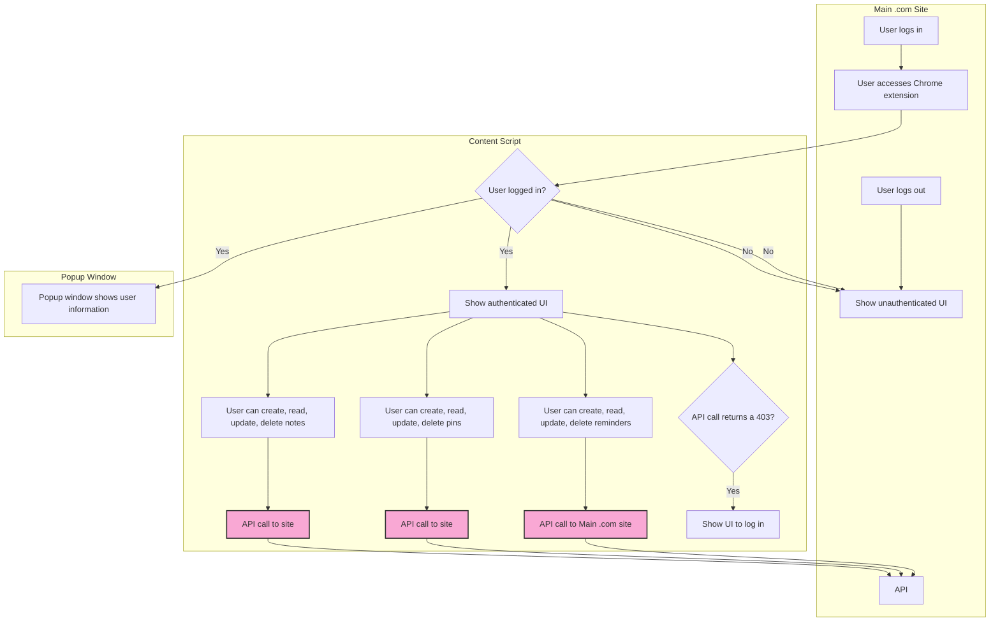
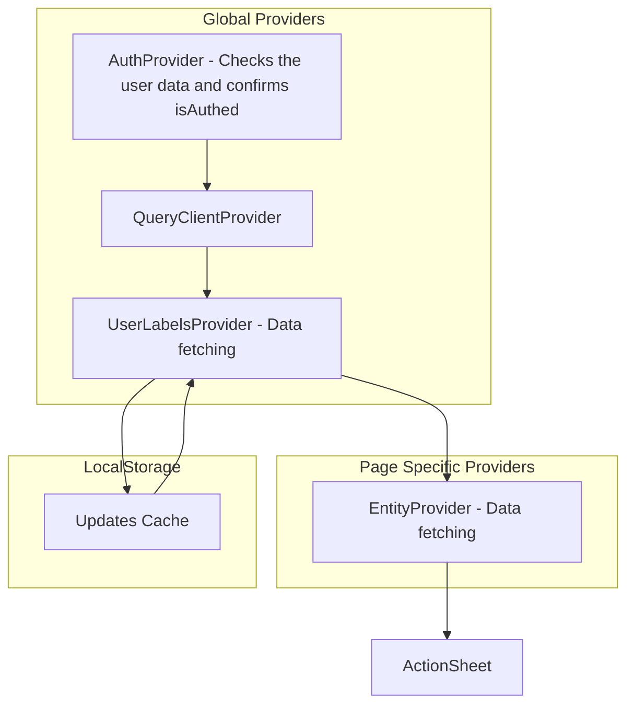

# extension-base

## Getting Started

First, run the development server:

```bash
pnpm dev
# or
npm run dev
```

Open your browser and load the appropriate development build. For example, if you are developing for the chrome browser, using manifest v3, use: `build/chrome-mv3-dev`.

You can start editing the popup by modifying `popup.tsx`. It should auto-update as you make changes. To add an options page, simply add a `options.tsx` file to the root of the project, with a react component default exported. Likewise to add a content page, add a `content.ts` file to the root of the project, importing some module and do some logic, then reload the extension on your browser.

For further guidance, [visit our Documentation](https://docs.plasmo.com/)

## Making production build

Run the following:

```bash
pnpm build
# or
npm run build
```

This should create a production bundle for your extension, ready to be zipped and published to the stores.

## Submit to the webstores

The easiest way to deploy your Plasmo extension is to use the built-in [bpp](https://bpp.browser.market) GitHub action. Prior to using this action however, make sure to build your extension and upload the first version to the store to establish the basic credentials. Then, simply follow [this setup instruction](https://docs.plasmo.com/framework/workflows/submit) and you should be on your way for automated submission!

## API Compatibility

| API             | Chrome       | Firefox      |
| --------------- | ------------ | ------------ |
| `tabs`          | ✅ Supported | ✅ Supported |
| - `query`       | ✅ Supported | ✅ Supported |
| - `sendMessage` | ✅ Supported | ✅ Supported |
| - `onUpdated`   | ✅ Supported | ✅ Supported |
| `webNavigation` | ✅ Supported | ✅ Supported |
| `cookies`       | ✅ Supported | ✅ Supported |
| `runtime`       | ✅ Supported | ✅ Supported |

## User access flow



## Data flow


